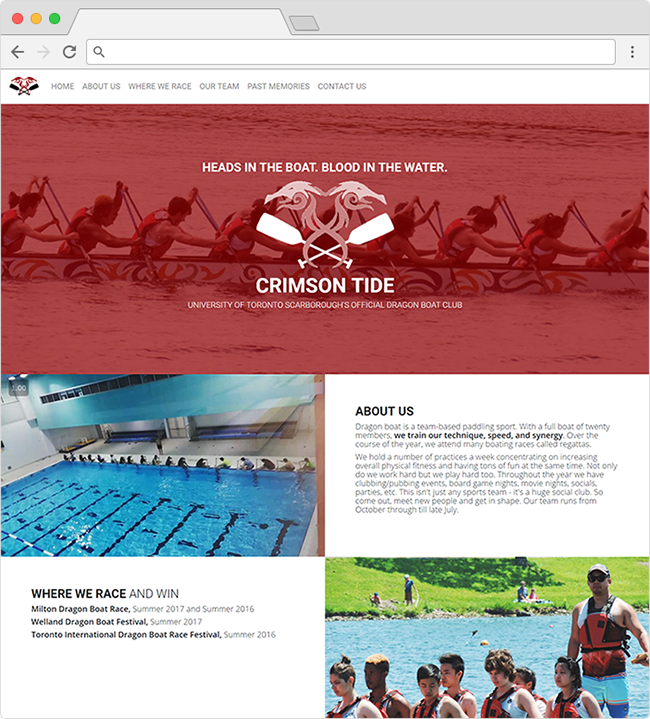

# Crimson Tide: UTSC Dragon Boat Website
Developed this static website for the Crimson Tide Dragon Boat Team at the University of Toronto. Used the Bootstrap framework. I did not modify the SCSS of the source files provided for the framework. Instead, I used the CSS files of the generic framework, and added CSS on top to modify styling.

View the website here: https://alvintang.me/crimsontide/

